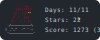

# Advent of Code Badge GitHub Action

<a href="https://adventofcode.com/">

</a>

## README adjustments

```html
<!-- START_AOC_BADGE -->

<!-- END_AOC_BADGE -->
```

## Example workflow

```yaml
name: Update AoC Badges
on:
  schedule: # runs scheduled
    - cron: '6 5 1-25 12 *' # 1. Dec - 25. Dec
    
  workflow_dispatch: # runs on manual dispatch 
  
jobs:
  update:
    runs-on: ubuntu-latest
    steps:
      - uses: actions/checkout@v4
          
      - uses: tim0-12432/aoc-badge-action
        with:
          userid: 123456 # The user to track
          session: ${{ secrets.AOC_SESSION }} # secret containing the session cookie
          
#         Optional inputs:
#         
#         leaderboard: 123456 # The leaderboard to track; defaults to the users private leaderboard
#         file: './README.md' # The file to add the badges to; defaults to ./README.md

      - uses: stefanzweifel/git-auto-commit-action@v5
        with:
          commit_message: Update AoC badge
          file_pattern: './README.md ./*.svg'
```
